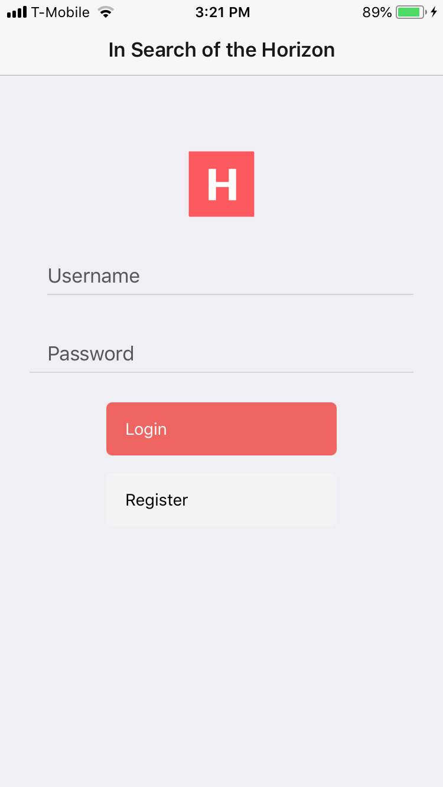
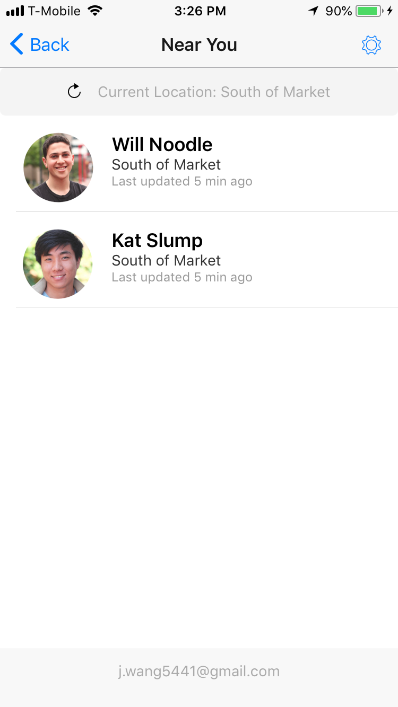
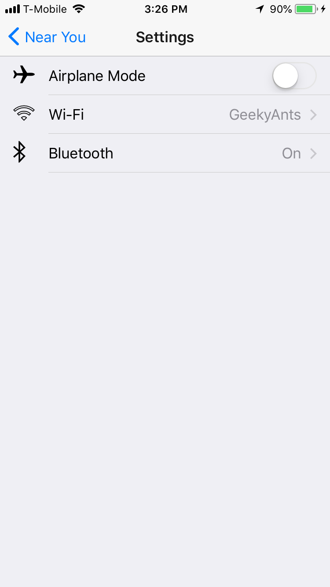
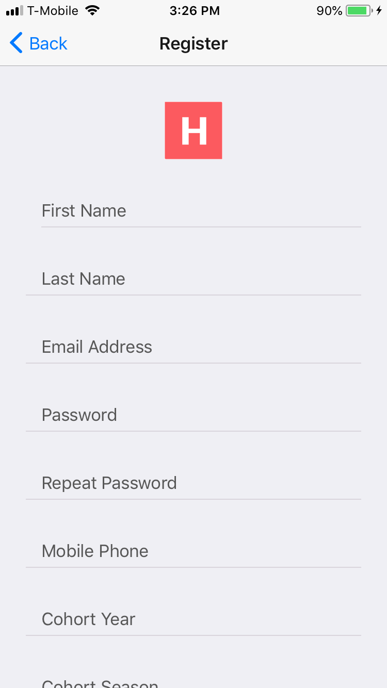

# In Search of the Horizon

Horizons S18 Hackathon: A social media application that allows users in similar programs to find each while in similar vicinities.

## The Inspiration
Horizons has been spitting out successful Horizonites for several years now. Some ended up in random cities, but most exist as clusters in cities such as SF, NYC, Seattle, etc. Because connections are arguably one of the most valuable ROI's of the program, it is important to keep tabs on fellow Horizonites- especially ones nearby. In Search of the Horizon makes certain each Horizonite is aware of the Horizon community that surrounds them every single day.

## User Stories
### v1:
- A user can login
- A user can sign up
- A users email can be verified via Horizon database
- A user is notified when a Horizonite is in the area
- A user can view a list of Horizonites in the area
- A user can see a Horizonites profile that contains their photo, first name, last name, phone, email, cohort, and short bio.
- A user can set their preferred radius for alerts

### v2:
- A user can snooze alerts for a certain period of time
- A user can silence alerts for certain users (ex: your roommate)
- A user can silence alerts for certain locations (ex: Hotel Epik)

### v3:
- A user can see the approximate area of Horizonites on a map

## Display
  Login page: 
  User page: 
  Setting page: 
  Registration page: 
  <!-- Login page:  -->

## Components
### Welcome
A welcome screen that gives the user an option to login or signup
### Login
A login screen that requests the users email and password
### Signup
A signup screen that requests the users first name, last name, email, password, photo, cohort, and short bio
### Main
A screen that shows the user other horizonites in their area in list format
### Profile
A popup that shows the users photo, first name, last name, phone, email, cohort, and short bio
### Settings
    -- Notifications
    -- Name
    -- Email
    -- Password
    -- Mobile Number
    -- Bio
    -- Cohort

## Technologies
- Express
- React
- React Native
- React Navigation
- MongoDB
- Expo
- Material UI
